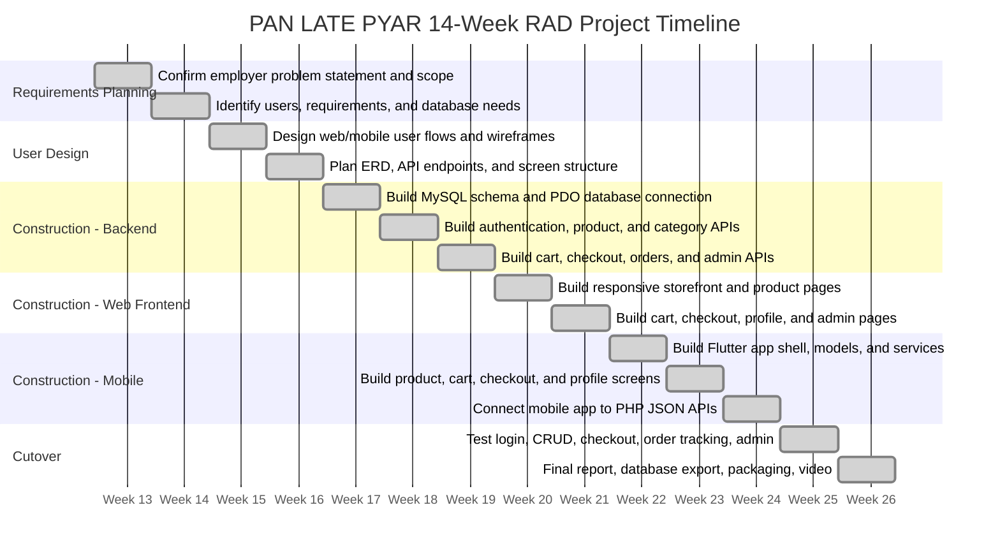
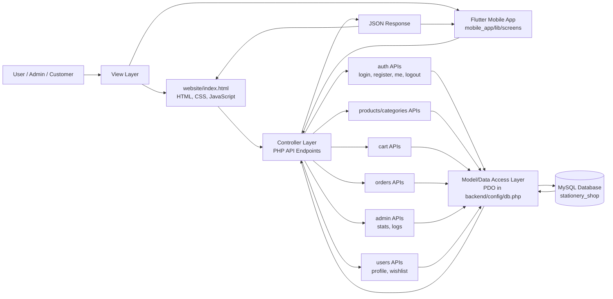
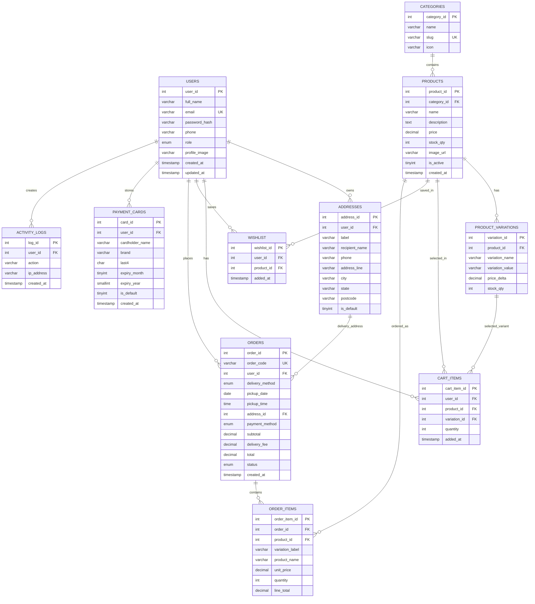
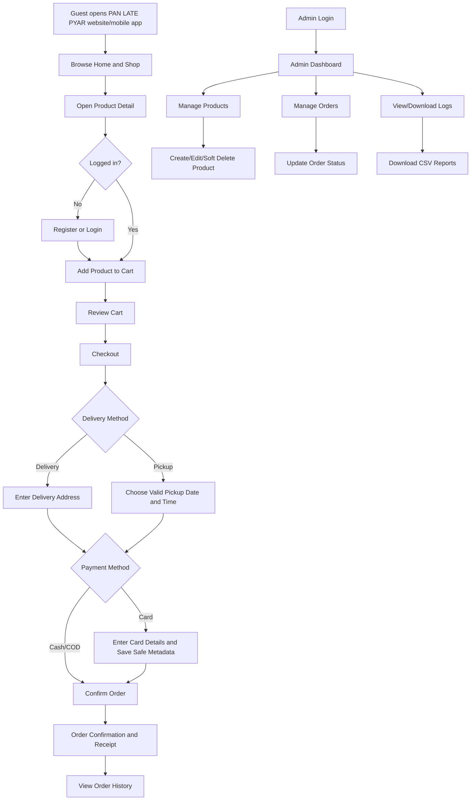

# PAN LATE PYAR Project Report Assets

This file contains project-equivalent report content for the PAN LATE PYAR stationery shop system. It is prepared for documentation/report use only and does not change the actual application code.

## 1.3.2 14-Week Gantt Chart



Summary table:

| Week | RAD Phase | Main Tasks | Output |
|---|---|---|---|
| 1-2 | Requirements Planning | Confirm employer problem, scope, users, functional requirements, and database requirements | Approved requirement list |
| 3-4 | User Design | Design UI flow, screen layout, ERD, and API endpoint plan | Wireframes, ERD plan, storyboard |
| 5-7 | Construction | Build MySQL database, PHP PDO connection, auth, products, cart, orders, admin logs | Working backend APIs |
| 8-9 | Construction | Build responsive web storefront, checkout, profile, admin dashboard, product/order management | Functional web app |
| 10-12 | Construction | Build Flutter app, models, services, screens, and shared_preferences session persistence | Functional mobile app |
| 13 | Cutover | Run validation tests, fix bugs, test responsiveness and workflows | UAT/test evidence |
| 14 | Cutover | Finalise report, export database, prepare walkthrough video and final submission | Final deliverables |

## 2.1.2 MVC Architecture Diagram



Explanation:

The PAN LATE PYAR system uses a lightweight API-based MVC structure. The View layer is represented by `website/index.html` for the web application and Flutter screens inside `mobile_app/lib/screens`. Controller logic is separated into endpoint folders such as `backend/api/auth`, `backend/api/products`, `backend/api/cart`, `backend/api/orders`, `backend/api/users`, and `backend/api/admin`. The Model/Data Access layer is represented by PDO queries using the shared database connection in `backend/config/db.php`. Data is stored in the MySQL database named `stationery_shop`.

## 2.2.3 ERD Diagram



## 2.3.1 Web Application Wireframe Instructions

Use the following wireframes/screens as report evidence for the web application:

| Screen | Main UI Elements | Purpose |
|---|---|---|
| Landing/Home | Sticky top navigation, brand logo, hero section, shop CTA, about/contact sections | Introduces PAN LATE PYAR and directs visitors to the shop |
| Shop/Product List | Category filters, product cards, search, add-to-cart buttons | Allows customers to browse stationery products |
| Product Detail | Product image, description, stock, price, quantity control, add-to-cart button | Shows full product information before purchase |
| Cart | Cart item rows, quantity update buttons, remove buttons, order summary | Allows customers to review and edit selected products |
| Checkout | Contact form, delivery/pickup option, pickup date/time, payment option, card form, summary | Collects order and payment details |
| Order Confirmation | Receipt, order code, timeline/status, pickup/delivery and payment details | Confirms order placement |
| Profile/Orders | User avatar, email, personal info, wishlist, order history | Allows customers to manage account and view orders |
| Admin Dashboard | Statistics cards, low stock list, admin sidebar | Gives admin a summary of business activity |
| Manage Products | Product table, add/edit modal, price/stock validation, soft delete | Allows admin to maintain inventory |
| Manage Orders | Order table, customer, total, delivery method, payment, status dropdown | Allows admin to update order status |
| Admin Logs | Activity/security log list and CSV download buttons | Provides audit trail and downloadable reports |

## 2.3.2 Mobile Wireframe Instructions

Use the following wireframes/screens as report evidence for the Flutter application:

| Screen | Main Flutter Widgets | Purpose |
|---|---|---|
| App Shell | `Scaffold`, `AppBar`, `NavigationBar`, `AnimatedSwitcher` | Provides shared mobile navigation |
| Home | `ListView`, `Chip`, `Card`, product tiles | Shows categories and featured products |
| Product List | `SearchBar`, `FilterChip`, `ListView`, product tiles | Allows mobile product browsing/search |
| Product Detail | `Scaffold`, `ProductImage`, `Text`, `FilledButton.icon` | Shows product details and add-to-cart action |
| Cart | `ListView`, `Card`, `ListTile`, quantity stepper, summary card | Allows mobile cart review and quantity changes |
| Checkout | `Form`, `TextFormField`, `SegmentedButton`, card validators | Collects delivery and payment details |
| Order Confirmation | `Icon`, order code, total, payment label, action button | Displays successful order result |
| Profile/Login | `Form`, `TextFormField`, `FilledButton`, `ListTile` | Handles login, registration, logout, and order history |

Native/mobile feature note:

The Flutter app uses `shared_preferences` to persist the PHP session cookie locally, allowing the app to remember the authenticated session between launches.

## 2.3.3 Storyboard Instructions



Storyboard description:

The customer journey begins with browsing the shop, opening a product detail page, logging in or registering, adding items to the cart, selecting delivery or pickup, choosing payment, and confirming the order. The admin journey begins with admin login and continues through dashboard review, product management, order status updates, and activity/security log downloads.

## 3.1.2 Code Snippet: database.php

Equivalent file in this project: `backend/config/db.php`

```php
<?php
/**
 * Database connection for PAN LATE PYAR.
 * Local XAMPP setup uses the default root user with no password.
 */
$DB_HOST = "localhost";
$DB_NAME = "stationery_shop";
$DB_USER = "root";
$DB_PASS = "";

try {
    $pdo = new PDO(
        "mysql:host=$DB_HOST;dbname=$DB_NAME;charset=utf8mb4",
        $DB_USER,
        $DB_PASS,
        [
            PDO::ATTR_ERRMODE => PDO::ERRMODE_EXCEPTION,
            PDO::ATTR_DEFAULT_FETCH_MODE => PDO::FETCH_ASSOC,
        ]
    );
} catch (PDOException $e) {
    http_response_code(500);
    echo json_encode([
        "error" => "Database connection failed: " . $e->getMessage()
    ]);
    exit;
}
```

## 3.1.3 Code Snippet: Model - create()

Equivalent endpoint in this project: `backend/api/products/create.php`

```php
<?php
// POST (admin only) { category_id, name, description, price, stock_qty, image_url }
require '../../includes/auth_check.php';
require '../../config/db.php';
require '../../includes/functions.php';

require_admin();
$data = json_decode(file_get_contents("php://input"), true);

$price = (float)($data['price'] ?? -1);
$stock = (int)($data['stock_qty'] ?? -1);

if (trim((string)($data['name'] ?? '')) === '' || $price < 0 || $stock < 0) {
    http_response_code(422);
    echo json_encode([
        "error" => "Product name is required, and price/stock cannot be less than 0"
    ]);
    exit;
}

$stmt = $pdo->prepare(
    "INSERT INTO products (category_id, name, description, price, stock_qty, image_url)
     VALUES (?, ?, ?, ?, ?, ?)"
);
$stmt->execute([
    $data['category_id'],
    $data['name'],
    $data['description'],
    $price,
    $stock,
    $data['image_url']
]);

log_action($pdo, $_SESSION['user_id'], "Created product {$data['name']}");
echo json_encode(["success" => true, "product_id" => $pdo->lastInsertId()]);
```

## 3.1.3 Code Snippet: Model - getAll() and getById()

Equivalent endpoints in this project: `backend/api/products/list.php` and `backend/api/products/get.php`

```php
<?php
// getAll equivalent: GET products with optional category/search filters
require '../../config/db.php';
require '../../config/config.php';

$sql = "SELECT p.*, c.name AS category_name, c.slug AS category_slug
        FROM products p
        LEFT JOIN categories c ON p.category_id = c.category_id
        WHERE p.is_active = 1";
$params = [];

if (!empty($_GET['category'])) {
    $sql .= " AND c.slug = ?";
    $params[] = $_GET['category'];
}

if (!empty($_GET['search'])) {
    $sql .= " AND p.name LIKE ?";
    $params[] = "%" . $_GET['search'] . "%";
}

$sql .= " ORDER BY p.created_at DESC, p.product_id DESC";
$stmt = $pdo->prepare($sql);
$stmt->execute($params);
echo json_encode($stmt->fetchAll());
```

```php
<?php
// getById equivalent: GET one product and its variations
require '../../config/db.php';
require '../../config/config.php';

$id = (int)($_GET['id'] ?? 0);

$stmt = $pdo->prepare("SELECT * FROM products WHERE product_id = ?");
$stmt->execute([$id]);
$product = $stmt->fetch();

$vstmt = $pdo->prepare("SELECT * FROM product_variations WHERE product_id = ?");
$vstmt->execute([$id]);
$product['variations'] = $vstmt->fetchAll();

echo json_encode($product);
```

## 3.1.3 Code Snippet: Model - update()

Equivalent endpoint in this project: `backend/api/products/update.php`

```php
<?php
// PUT (admin only) { product_id, name, price, stock_qty, ... }
require '../../includes/auth_check.php';
require '../../config/db.php';
require '../../includes/functions.php';

require_admin();
$data = json_decode(file_get_contents("php://input"), true);

$price = (float)($data['price'] ?? -1);
$stock = (int)($data['stock_qty'] ?? -1);

if (trim((string)($data['name'] ?? '')) === '' || $price < 0 || $stock < 0) {
    http_response_code(422);
    echo json_encode([
        "error" => "Product name is required, and price/stock cannot be less than 0"
    ]);
    exit;
}

$stmt = $pdo->prepare(
    "UPDATE products
     SET category_id=?, name=?, description=?, price=?, stock_qty=?, image_url=?
     WHERE product_id=?"
);
$stmt->execute([
    $data['category_id'],
    $data['name'],
    $data['description'],
    $price,
    $stock,
    $data['image_url'],
    $data['product_id']
]);

log_action($pdo, $_SESSION['user_id'], "Updated product {$data['name']}");
echo json_encode(["success" => true]);
```

## 3.1.3 Code Snippet: Model - delete()

Equivalent endpoint in this project: `backend/api/products/delete.php`

```php
<?php
// DELETE (admin only) ?id=123 -> soft delete
require '../../includes/auth_check.php';
require '../../config/db.php';
require '../../includes/functions.php';

require_admin();

$nameStmt = $pdo->prepare("SELECT name FROM products WHERE product_id = ?");
$nameStmt->execute([$_GET['id']]);
$name = $nameStmt->fetchColumn() ?: "ID {$_GET['id']}";

$stmt = $pdo->prepare("UPDATE products SET is_active = 0 WHERE product_id = ?");
$stmt->execute([$_GET['id']]);

log_action($pdo, $_SESSION['user_id'], "Removed product {$name}");
echo json_encode(["success" => true]);
```

## 3.2.2 Flutter Folder Structure

Actual/equivalent folder structure:

```text
mobile_app/
  pubspec.yaml
  lib/
    main.dart
    constants/
      api_config.dart
    models/
      user.dart
      product.dart
      order.dart
      cart_item.dart
    services/
      api_service.dart
      auth_service.dart
      cart_service.dart
    screens/
      landing_screen.dart
      login_screen.dart
      signup_screen.dart
      home_screen.dart
      product_list_screen.dart
      product_detail_screen.dart
      cart_screen.dart
      checkout_screen.dart
      order_screen.dart
      profile_screen.dart
      admin/
        admin_dashboard.dart
        manage_products.dart
        manage_orders.dart
        admin_logs.dart
    widgets/
      nav_bar.dart
      product_card.dart
      cart_item_tile.dart
    utils/
      constants.dart
  android/
    app/
    gradle/
```

Architecture summary:

- `main.dart` starts the Flutter app and provides global state using `Provider`.
- `services/api_service.dart` sends HTTP requests to the PHP backend and stores the PHP session cookie using `shared_preferences`.
- `models/` contains Dart data classes for users, products, cart items, and orders.
- `screens/` contains customer and admin UI screens.
- `widgets/` contains reusable UI components such as product cards and cart item tiles.

## 3.2.3 Code Snippet: main.dart Theme Configuration

Equivalent theme configuration from `mobile_app/lib/main.dart`:

```dart
class PanLatePyarApp extends StatelessWidget {
  const PanLatePyarApp({super.key});

  @override
  Widget build(BuildContext context) {
    return MultiProvider(
      providers: [
        Provider(create: (_) => ApiService()),
        ChangeNotifierProvider(create: (_) => ShopState()..bootstrap()),
      ],
      child: MaterialApp(
        title: 'PAN LATE PYAR',
        debugShowCheckedModeBanner: false,
        theme: ThemeData(
          useMaterial3: true,
          colorScheme: ColorScheme.fromSeed(
            seedColor: const Color(0xFF3E5C46),
            brightness: Brightness.light,
          ),
          scaffoldBackgroundColor: const Color(0xFFFBF9F3),
          cardTheme: const CardThemeData(
            elevation: 0,
            margin: EdgeInsets.zero,
            shape: RoundedRectangleBorder(
              borderRadius: BorderRadius.all(Radius.circular(8)),
            ),
          ),
        ),
        home: const AppShell(),
      ),
    );
  }
}
```

Theme explanation:

The Flutter app uses Material 3, a green seed colour matching the PAN LATE PYAR shop identity, a warm paper-like scaffold background, and compact 8px card radius to keep the mobile design consistent with the web application.
